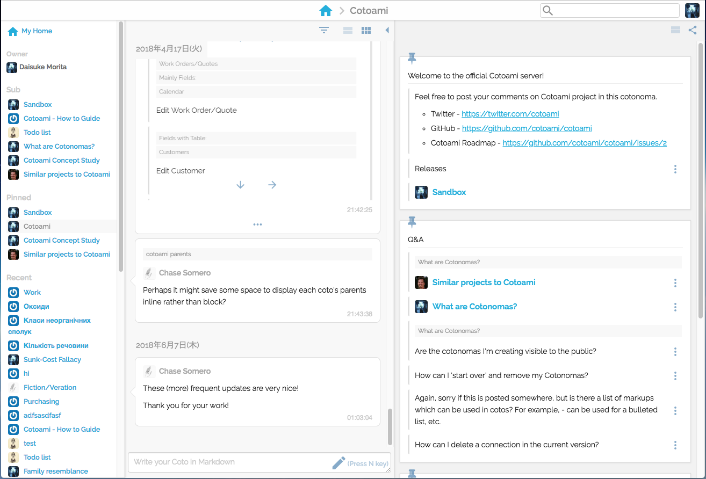
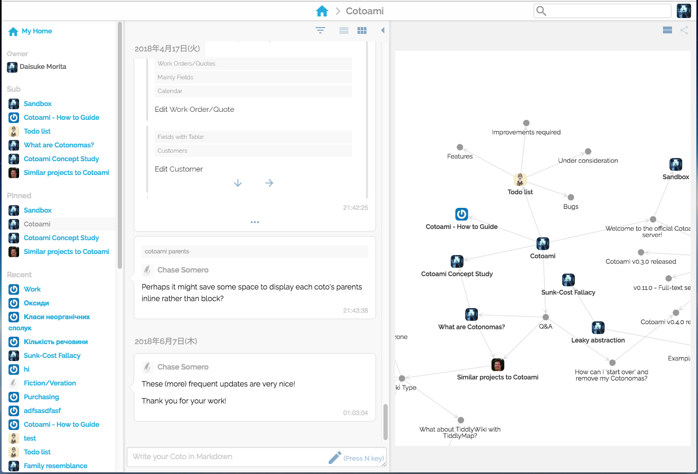
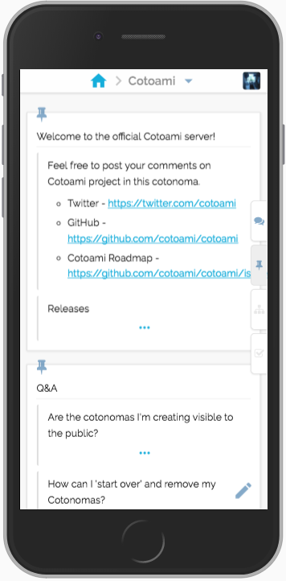
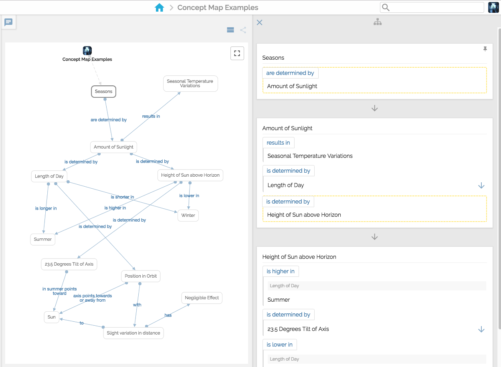
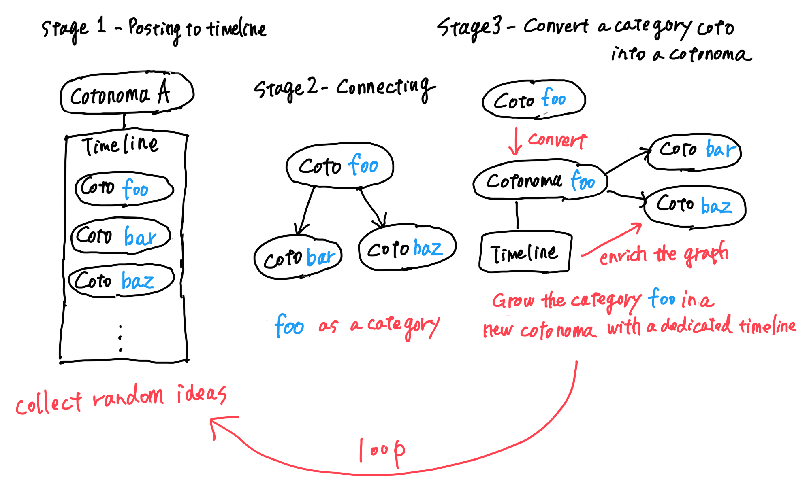
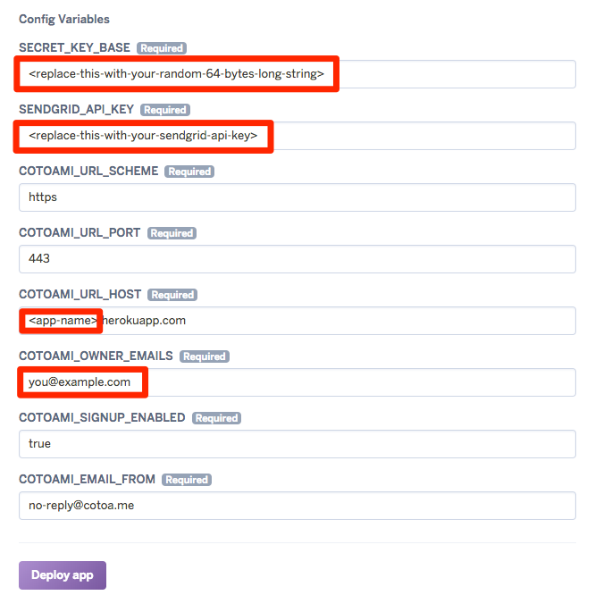

<p align="center"></p>


[](https://circleci.com/gh/cotoami/cotoami)

Cotoami (言編み・言網) is a platform where people can weave a large network of knowledge from tiny ideas.


## Screenshots









## Concept

* **Coto**: Post. A unit of information in Cotoami.
* **Cotonoma**: A Cotonoma is a chatroom-like unit which has its own timeline and pinned Cotos.


As you can see in the image above, Cotonomas are posted to a timeline like Cotos.
Actually, you can treat Cotonomas as Cotos. They can be pinned to another
Cotonoma or connected to other Cotos.

### Cotoami's concept of knowledge generation



1. Collect random ideas by posting Cotos to a timeline.
2. Look for connections between Cotos and make them as they are found.
3. Cotonomatize: Convert a hub Coto that has many outbound connections and looks worth discussing into a Cotonoma.
4. Repeat the same thing in the new Cotonoma.


## Try it

### Official demo server

There is an official Cotoami server to demonstrate its features.

The official Cotoami server - [https://cotoa.me/](https://cotoa.me/)

### Launch your own server with Docker

The easiest way to launch your own Cotoami server is to use Docker. If you have a Docker environment running 
(`docker info` outputs some info), just execute the following command:

```
$ wget -qO - https://raw.githubusercontent.com/cotoami/cotoami/master/launch/run.sh | bash
```

If you want to stop the servers (a Cotoami server and backend services like databases), execute the following command in the same directory:

```
$ docker-compose stop
```

### Launch your own server on Heroku

You can launch your own Cotoami server on Heroku by clicking the following Heroku Button:

[](https://heroku.com/deploy)

and set the required configurations.



Replace the highlighted values with your custom values:

* `SECRET_KEY_BASE`
    * Specify a random 64-bytes-long string.
        * e.g. `Y/j0csZXyV2On8uX1TIZXAkR6K8w45egzL76xIV/6jyfPuaZ5A5j5mAtoTsMw3CE`
* `SENDGRID_API_KEY`
    * This is a tricky part of the deployment. You need to obtain a SendGrid (an email sending service) API key by following the instructions in the "Obtain a SendGrid API key" section below.
* `COTOAMI_URL_HOST`
    * Replace `<app-name>` with your Heroku app name.
* `COTOAMI_OWNER_EMAILS`
    * Specify owner email addresses (comma separated).

You should know the limitations of Cotoami on Heroku as described in:

* <https://hexdocs.pm/phoenix/heroku.html#limitations>
    
#### Obtain a SendGrid API key

1. First, you need to get SendGrid's username and password by deploying an app (Click the "Deploy app" button in the Heroku site).
2. After finishing the deployment, you can check your username and password via config vars: `SENDGRID_USERNAME` and `SENDGRID_PASSWORD`, which can be viewed in the app's settings page in the Heroku site (click the "Reveal Config Vars" button).
3. Go to <https://app.sendgrid.com/settings/api_keys> and log in with the username and password.
4. Create an API key.
5. Set the obtained key to the config `SENDGRID_API_KEY` in the Heroku app's settings page (then the app will restart automatically).

* ref. [SendGrid \| Heroku Dev Center](https://devcenter.heroku.com/articles/sendgrid)


## Related URLs

* News and updates - https://twitter.com/cotoami
* Docker image - https://hub.docker.com/r/cotoami/cotoami/


## Special Thanks

* Sponsored by [UNIVA Paycast](https://www.univapay.com) until Aug 2018.
* The logo is designed by [@reallinfo](https://github.com/reallinfo)
    * https://github.com/cotoami/cotoami/pull/107


## License

Cotoami source code is released under Apache 2 License.

Check [LICENSE](LICENSE) file for more information.
