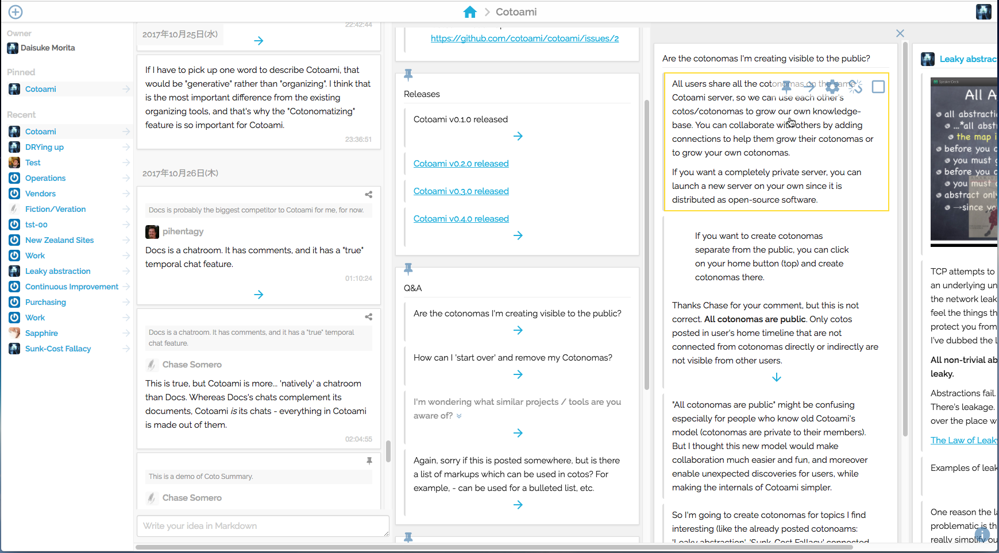
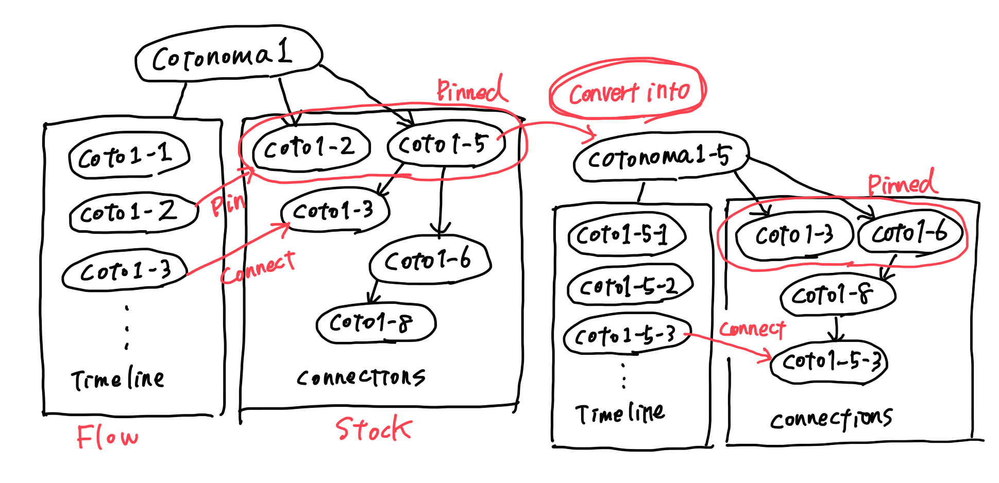

Cotoami
=======

[](https://circleci.com/gh/cotoami/cotoami)

Cotoami (言編み・言網) is a platform where people can weave a large network of knowledge from tiny ideas.

Cotoami is an open source project, sponsored by [UNIVA Paycast](https://www.univapay.com) under the Apache 2.0 Licence.


## Screenshots




## Try it

There is an official Cotoami server to demonstrate its features and
*generative knowledge sharing* which this project aims to promote.

The official Cotoami server - [https://cotoa.me/](https://cotoa.me/)


## Concept

* **Coto**: Post. A unit of information in Cotoami.
* **Cotonoma**: Chatroom-like unit which has a timeline and coto-connections. Nestable.
    * Cotonoma is a kind of coto



Cotoami's concept of knowledge generation:


## Development

* Cotoami Roadmap - https://github.com/cotoami/cotoami/issues/2
* News and updates - https://twitter.com/cotoami


## Requirements

* Node.js 5.0.0 or greater
* Elixir 1.3.x
    * https://elixir-lang.org/install.html
* Phoenix 1.2.x
    * http://www.phoenixframework.org/docs/installation


## Run application on localhost

If you have a Docker environment running (`docker info` outputs some info), just execute the following command:

```
$ ./launch-on-local.sh
...
[info] Running Cotoami.Endpoint with Cowboy using http://localhost:4000
[info] Running migrations on start...
[info] Already up
...
```

Now you can visit `localhost:4000` from your browser.

### Dummy mail server

There should be a line like `You can check sign-up/in mails at <url>` in the output log.
You can access the test mail server via the `<url>` to check sign-up/in mails.
